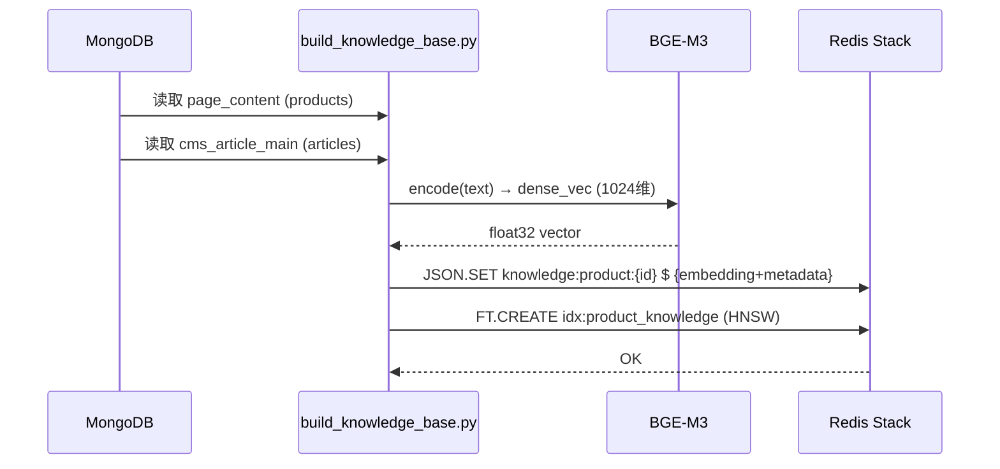
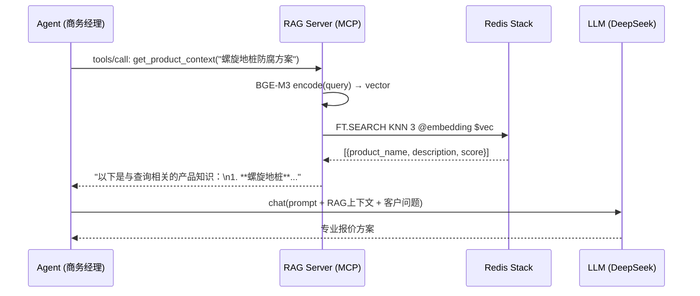

# LightingMetal Commander — 全栈集成指南

> 版本: v2.3.1 | 最后更新: 2026-05-24

本文档描述 Commander 生态系统的完整集成关系：从数据层（MongoDB/Redis）到认知层（RAG 知识库），从扩展层（Skill/MCP 动态挂载）到部署层（Docker Compose 三种模式）。

---

## 目录

1. [系统全景](#1-系统全景)
2. [数据流](#2-数据流)
3. [RAG 知识库集成](#3-rag-知识库集成)
4. [MCP Server 生态](#4-mcp-server-生态)
5. [扩展路由器工作流](#5-扩展路由器工作流)
6. [Agent 使用 RAG 示例](#6-agent-使用-rag-示例)
7. [部署拓扑](#7-部署拓扑)
8. [运维命令速查](#8-运维命令速查)
9. [故障恢复流程](#9-故障恢复流程)

---

## 1. 系统全景

```
┌─────────────────────────────────────────────────────────────────┐
│                        用户请求                                  │
│   "沙特50MW光伏项目 螺旋地桩防腐方案报价"                           │
└───────────────────────────┬─────────────────────────────────────┘
                            │
                            ▼
┌─────────────────────────────────────────────────────────────────┐
│  Commander v2.3                                                 │
│  ┌─────────────────────────────────────────────────────────┐    │
│  │ ExtensionRouter.analyze_and_extend()                    │    │
│  │   ├─ 检测关键词: "报价" → 需要 售前经理                   │    │
│  │   ├─ 检测关键词: "产品查询" → 需要 MCP Server             │    │
│  │   └─ 缺口检测: lightingmetal-rag 未注册 → 自动安装        │    │
│  └─────────────────────────────────────────────────────────┘    │
│  ┌─────────────────────────────────────────────────────────┐    │
│  │ TaskAnalyzer → ABTester → TaskDegradation → LLMRouter   │    │
│  └─────────────────────────────────────────────────────────┘    │
└───────────────────────────┬─────────────────────────────────────┘
                            │ Redis Pub/Sub
                            ▼
┌─────────────────────────────────────────────────────────────────┐
│  Agent 集群 (Supervisord 管理)                                   │
│                                                                  │
│  ┌──────────┐    ┌──────────┐    ┌──────────┐                  │
│  │ 商务经理   │◄──►│ 售前经理   │◄──►│ 翻译官    │                  │
│  │ 接待客户   │    │ 生成报价   │    │ 多语翻译   │                  │
│  └─────┬─────┘    └─────┬─────┘    └──────────┘                  │
│        │                │                                        │
│        └───────┬────────┘                                        │
│                │ MCP JSON-RPC                                    │
│                ▼                                                 │
│  ┌─────────────────────────────────────────┐                    │
│  │ lightingmetal-rag MCP Server             │                    │
│  │  ├─ search_product_knowledge(query)      │                    │
│  │  └─ get_product_context(query)           │                    │
│  └────────────────┬────────────────────────┘                    │
└───────────────────┼──────────────────────────────────────────────┘
                    │
        ┌───────────┼───────────┐
        ▼                       ▼
┌───────────────┐     ┌──────────────────┐
│ Redis Stack   │     │ MongoDB 7        │
│ 向量索引       │     │ page_content     │
│ HNSW COSINE  │     │ cms_article_main │
└───────────────┘     └──────────────────┘
```

---

## 2. 数据流

### 2.1 知识入库



### 2.2 检索流程



### 2.3 Redis Key 命名空间

```
commander:*               ← Commander 引擎（Agent 注册表/任务队列/AB测试）
agent:*                   ← Agent 运行时（心跳/状态/指标）
skills:*                  ← Skill 注册表
mcp:*                     ← MCP Server 注册表
extensions:*              ← 扩展路由器决策记录
knowledge:*               ← RAG 向量文档（JSON）
lightingmetal:*           ← 业务数据（只读）
page:*                    ← 页面数据（只读）
```

---

## 3. RAG 知识库集成

### 3.1 组件关系

| 组件 | 文件 | 职责 |
|------|------|------|
| 向量化脚本 | `ai-server/scripts/build_knowledge_base.py` | MongoDB → BGE-M3 → Redis Stack |
| MCP Server | `ai-server/mcp-servers/lightingmetal-rag/server.py` | JSON-RPC stdio 协议 |
| VectorStore | `server.py::VectorStore` | 双模存储（RediSearch / 手动余弦） |
| EmbeddingService | `server.py::EmbeddingService` | BGE-M3 编码 + 降级 |

### 3.2 部署决策树

```
是否需要产品知识检索？
├─ 是
│   ├─ 有 GPU？ → Redis Stack (GPU 加速 BGE-M3)
│   └─ 无 GPU？ → Redis Stack (CPU BGE-M3, ~500ms/query)
│       └─ Redis Stack 不可用？ → 基础 Redis 手动余弦（自动降级）
└─ 否 → 跳过 RAG profile
```

### 3.3 首次构建

```bash
# 1. 启动 Redis Stack
docker compose --profile rag up -d redis-stack

# 2. 等待就绪
./scripts/wait-for-it.sh redis-stack:6379 -t 30

# 3. 构建知识库（全量）
docker compose --profile rag run --rm rag-builder

# 4. 验证
docker compose exec redis-stack redis-cli FT.INFO idx:product_knowledge
# 期望: num_docs > 0

# 5. 启动 RAG Server
docker compose --profile rag up -d rag-server
```

---

## 4. MCP Server 生态

### 4.1 已注册列表

| Server | 类型 | Command | 状态 | 触发词 |
|--------|------|---------|------|--------|
| **lightingmetal-rag** | Python | `python3 server.py` | 内置 | 知识库/产品查询/RAG |
| **mongodb** | npx | `@anthropic/mcp-server-mongodb` | 可选 | 数据库/MongoDB |
| **firecrawl** | npx | `@anthropic/mcp-server-firecrawl` | 可选 | 爬取/抓取 |
| **github** | npx | `@anthropic/mcp-server-github` | 可选 | GitHub/git |

### 4.2 注册流程

```
1. config/mcp-servers.json ──→ entrypoint.sh (阶段3)
                                  │
                                  ▼
2. MCPManager.register_mcp_server() → Redis mcp:registry
                                  │
                                  ▼
3. Commander._bootstrap_extension_registry()
   ├─ LocalSkillAdapter.bootstrap_local_skills()
   └─ MCPBootstrap.bootstrap()
                                  │
                                  ▼
4. ExtensionRouter.analyze_and_extend()
   └─ 关键词匹配 → _decide_extension_strategy() → _execute_strategy()
```

### 4.3 MCPBootstrap 逻辑

```python
# 启动时自动同步 mcp.json / mcp-servers.json → Redis
class MCPBootstrap:
    def bootstrap(self):
        config = self.manager._load_config()  # 读取 mcp-servers.json
        for name, cfg in config["mcpServers"].items():
            self.manager.redis.hset("mcp:registry", name, json.dumps(meta))
            self.manager.redis.hset("mcp:status", name, "registered")
```

---

## 5. 扩展路由器工作流

### 5.1 完整决策树

```
handle_task(task)
  │
  ▼
ExtensionRouter.analyze_and_extend(task)
  │
  ├─ 1. AgentDesigner.analyze_and_design(task)
  │     └─ LLM 分析: 需要什么 Skill / MCP / Agent？
  │
  ├─ 2. _find_capability_gaps(design)
  │     ├─ skill 缺口：已安装的 Skill vs 需要的 Skill
  │     ├─ mcp 缺口：已注册的 MCP vs 需要的 MCP
  │     └─ agent 缺口：在线 Agent vs 需要的 Agent
  │
  ├─ 3. _decide_extension_strategy(gap)
  │     ├─ install_skill     (npm/github/local) → auto/manual
  │     ├─ register_mcp      (npx/python3)       → auto/manual
  │     ├─ create_agent      (ephemeral)          → auto
  │     └─ create_skill_blueprint                → manual (需审核)
  │
  └─ 4. _execute_strategy()
        ├─ SkillManager.install_skill()
        ├─ MCPManager.register_mcp_server()
        └─ LifecycleManager.request_agent()
```

### 5.2 RAG 触发示例

```
输入: "沙特50MW光伏项目螺旋地桩防腐方案报价"

AgentDesigner 分析 → {
  skills: [],
  mcps: ["lightingmetal-rag"],    ← "产品知识/方案" 触发
  agents: ["售前经理", "商务经理"]
}

_find_capability_gaps → {
  mcp: ["lightingmetal-rag"]      ← 未在 mcp:registry 中 → 缺口
}

_decide_extension_strategy → {
  action: "register_mcp",
  params: {
    server_name: "lightingmetal-rag",
    command: "python3",
    args: ["/app/ai-server/mcp-servers/lightingmetal-rag/server.py"]
  },
  risk: "auto"                     ← 已知Server，自动执行
}
```

---

## 6. Agent 使用 RAG 示例

### 6.1 商务经理：询盘处理

```python
# 客户询盘: "We need 5000 sets of ground screws for a 50MW solar farm in Saudi Arabia"

# Step 1: 检索产品知识
from server import LightingMetalRAG
rag = LightingMetalRAG(redis_host="redis-stack", redis_port=6379)
context = rag.get_product_context("Saudi solar farm ground screw anti-corrosion", top_k=3)

# Step 2: 构建 Prompt
prompt = f"""
You are LightingMetal's Business Manager. Reply based on this product knowledge:

{context}

Customer inquiry: {customer_query}

Requirements:
- Respond in the customer's language
- Quote technical specs from the knowledge base
- Mention ISO 1461 hot-dip galvanizing standard
- Ask for specific quantity and delivery requirements
"""

# Step 3: LLM 生成回复
reply = llm.chat(prompt)
```

### 6.2 售前经理：报价方案

```python
# Step 1: 精确检索产品规格
products = rag.search("ground screw hot-dip galvanized ISO 1461", top_k=5, category="product")

# Step 2: 检索应用案例
cases = rag.search("Saudi Arabia Middle East solar farm ground screw", top_k=3, category="article")

# Step 3: 构建报价方案
quote_prompt = f"""
Product Specs:
{chr(10).join(f"- {p['product_name']}: {p['description'][:100]}" for p in products)}

Reference Cases:
{chr(10).join(f"- {c['product_name']}" for c in cases)}

Quantity: {quantity} sets
Market: {market}

Generate: FOB + CIF quotation with delivery timeline
"""
```

---

## 7. 部署拓扑

### 7.1 网络端口映射

```
                          ┌─────────────────┐
                          │   Nginx/反向代理  │  (可选)
                          │   :443 → :3003  │
                          └────────┬────────┘
                                   │
┌──────────────────────────────────┼──────────────────────────┐
│                         Docker Network: commander-net        │
│                                                                 
│  ┌─────────────┐  ┌─────────────┐  ┌──────────────────────┐ │
│  │ redis:6379  │  │ mongo:27017 │  │ commander:3003,7681  │ │
│  └─────────────┘  └─────────────┘  └──────────────────────┘ │
│                                                                 
│  [Profile: rag]                                                │
│  ┌────────────────────┐  ┌─────────────────────────────┐     │
│  │ redis-stack:6379   │  │ rag-server (MCP stdio)       │     │
│  └────────────────────┘  └─────────────────────────────┘     │
└──────────────────────────────────────────────────────────────┘
```

### 7.2 容器资源分配

| 容器 | CPU | 内存 | 磁盘 | 启动顺序 |
|------|-----|------|------|---------|
| redis | 0.5 core | 512MB | 2GB (AOF) | 1 |
| mongo | 1 core | 1GB | 10GB | 2 |
| commander | 2 core | 2GB | 1GB (logs) | 3 |
| redis-stack | 1 core | 3GB | 5GB | 2b |
| rag-server | 2 core | 4GB | 2GB (models) | 4 |

---

## 8. 运维命令速查

### 启动与停止

```bash
# 分离架构
docker compose up -d                    # 启动
docker compose down                     # 停止+清理容器
docker compose down -v                  # 停止+清理卷（⚠️数据丢失）

# RAG 增强
docker compose --profile rag up -d      # 启动全栈
docker compose --profile rag run --rm rag-builder  # 构建知识库

# 开发模式
docker compose -f docker-compose.yml -f docker-compose.dev.yml up -d
```

### 监控

```bash
docker compose ps                       # 服务状态
docker compose logs -f commander        # 实时日志
docker compose exec commander supervisorctl status  # 进程状态
docker compose exec commander /app/scripts/healthcheck.sh  # 健康检查
```

### 数据操作

```bash
# Redis 数据查询
docker compose exec redis redis-cli -a '${REDIS_PASSWORD}' KEYS 'commander:*'
docker compose exec redis redis-cli -a '${REDIS_PASSWORD}' HGETALL 'mcp:registry'

# MongoDB 数据查询
docker compose exec mongo mongosh --quiet \
  --eval 'use lightingmetal; db.routing_decisions.countDocuments()'

# RAG 索引查询
docker compose exec redis-stack redis-cli FT.INFO idx:product_knowledge
docker compose exec redis-stack redis-cli FT.SEARCH idx:product_knowledge "光伏" LIMIT 0 5
```

---

## 9. 故障恢复流程

### 9.1 Redis 数据丢失

```
症状: commander:agents:registry 为空
根因: Redis 重启且 AOF/RDB 损坏
恢复:
  1. docker compose stop commander
  2. docker compose exec redis redis-cli -a '...' BGREWRITEAOF
  3. 检查 commander:agents:registry 是否恢复
  4. 如未恢复 → 从 MongoDB extension_registry 重建
  5. 重新注册 MCP: docker compose restart commander (触发 entrypoint.sh 阶段3)
  6. docker compose start commander
```

### 9.2 RAG 索引丢失

```
症状: FT.INFO idx:product_knowledge → "Unknown index name"
恢复:
  docker compose --profile rag run --rm rag-builder
  # 从 MongoDB 全量重新向量化
```

### 9.3 Agent 进程崩溃

```
症状: supervisorctl status → agent-business FATAL
恢复:
  docker compose exec commander supervisorctl restart agent-business
  # Supervisor 自带 autorestart=true，通常自动恢复
```

### 9.4 LLM API 不可用

```
症状: llm_router.py 返回 "All models unavailable"
恢复:
  1. docker compose exec commander supervisorctl restart commander
  2. 检查 LLM_API_KEY 是否有效
  3. 如主模型不可用，LLMRouter 自动降级到 LLM_FALLBACK_MODEL
```
